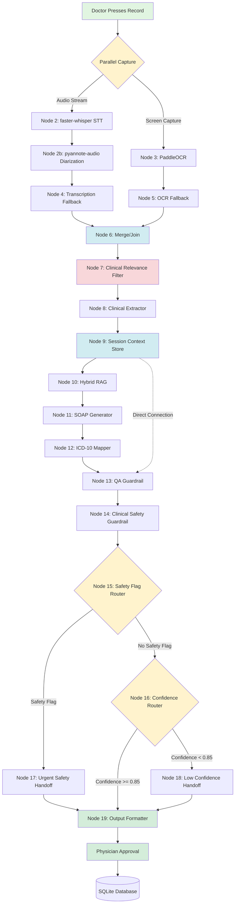

# MedScribe Workflow — 19-Node Pipeline

This document provides a detailed explanation of the complete MedScribe workflow, from audio capture to physician-approved SOAP note.

---

## Visual Workflow Overview



---

## Detailed Node Explanations

### **PHASE 1: Parallel Input Capture**

#### Node 1: INPUT (Entry Point)
**What happens**: Doctor opens MedScribe and presses the record button once.

**Two simultaneous processes launch**:
1. Audio capture via microphone → faster-whisper
2. Screen capture of active PDF → PaddleOCR

**Key innovation**: One button, two inputs captured simultaneously. No separate upload step for test reports.

**Output**:
- `audio_stream` → Node 2
- `screen_capture` → Node 3

---

#### Node 2: faster-whisper Speech-to-Text
**Technology**: faster-whisper (local, GPU-accelerated)

**Input**: `audio_stream` (real-time audio from consultation)

**Process**:
1. Converts speech to text in real-time
2. Handles medical terminology well
3. Runs locally (no API calls, no cost, privacy-preserving)

**Output**: `transcript_raw` (plain text without speaker labels)

**Next**: Node 2b (pyannote-audio Diarization)

---

#### Node 2b: pyannote-audio Speaker Diarization
**Technology**: pyannote-audio (HuggingFace model)

**Input**: 
- `audio_stream` (original audio)
- `transcript_raw` (text from faster-whisper)

**Process**:
1. Identifies who is speaking in each utterance
2. Labels each sentence as [Doctor] or [Patient]
3. Assigns confidence score to each speaker attribution

**Output**: `transcript_diarized`
```json
{
  "utterances": [
    {
      "speaker": "Doctor",
      "text": "How long have you had this pain?",
      "confidence": 0.92,
      "timestamp": "00:00:05"
    },
    {
      "speaker": "Patient",
      "text": "About three days. Gets worse at night.",
      "confidence": 0.88,
      "timestamp": "00:00:08"
    }
  ]
}
```

**Why this matters**: Symptoms must come from Patient. Prescriptions must come from Doctor. Mixing them up is a clinical error.

**Next**: Node 4 (Transcription Fallback)

---

#### Node 3: PaddleOCR Test Report Reading
**Technology**: PaddleOCR (local, free)

**Input**: `screen_capture` (screenshot of active PDF on doctor's screen)

**Process**:
1. Detects text regions in the image
2. Recognizes printed text (lab values, test names)
3. Extracts numerical values: HbA1c, BP, blood work results

**Output**: `test_report_values`
```json
{
  "HbA1c": "8.2%",
  "BP": "148/92",
  "Cholesterol": "220 mg/dL",
  "source": "ocr",
  "confidence": 0.95
}
```

**Key innovation**: No separate upload step. System reads whatever PDF is open on screen automatically.

**Next**: Node 5 (OCR Fallback)

---

### **PHASE 2: Fallback Mechanisms**

#### Node 4: Transcription Fallback
**Type**: Retry/Fallback

**Trigger**: faster-whisper or pyannote-audio fails (timeout, poor audio quality, network error)

**Process**:
1. Retry transcription with backoff (500ms, then 1000ms)
2. Max retries: 2
3. If all retries fail: Switch to **manual text input mode**

**Fallback behavior**: Text box appears, doctor types consultation notes

**Output**: Structured signal (never null)
```json
{
  "transcript": "<doctor typed text>",
  "source": "manual_input",
  "diarization_available": false
}
```

**Critical difference from OCR fallback**: Full method replacement, not partial degradation. Manual typing replaces entire transcription.

**Next**: Node 6 (Merge/Join)

---

#### Node 5: OCR Fallback
**Type**: Retry/Fallback

**Trigger**: PaddleOCR fails (unreadable PDF, no PDF open, scanned image quality issues)

**Process**:
1. Retry OCR with backoff (500ms, then 1000ms)
2. Max retries: 2
3. If all retries fail: Pass **structured unavailable signal**

**Fallback behavior**: Lab values marked as `pending_manual_entry`

**Output**: Structured signal (never null)
```json
{
  "test_values": "unavailable",
  "reason": "pdf_read_failure",
  "action": "physician_manual_entry"
}
```

**Critical difference from Transcription fallback**: Partial degradation, not full replacement. Pipeline continues WITHOUT test values. Gap is explicitly marked and carried forward.

**Why structured signal, not null?**: Null breaks downstream nodes. Structured signal tells every agent exactly what happened and how to handle it.

**Next**: Node 6 (Merge/Join)

---

### **PHASE 3: Merge & Clinical Filtering**

#### Node 6: Merge/Join
**Type**: Synchronization Point

**Function**: Wait for both parallel branches to complete (whether successful or fallen back)

**Input**:
- `transcript_diarized` (or manual input signal)
- `test_report_values` (or unavailable signal)

**Output**: Single unified consultation input
```json
{
  "transcript": {...},
  "test_values": {...},
  "sources": ["whisper", "ocr"],
  "fallbacks_triggered": []
}
```

**Why this matters**: This is where two parallel streams become one unified pipeline. Every downstream node works with this combined object.

**Next**: Node 7 (Clinical Relevance Filter)

---

#### Node 7: Clinical Relevance Filter (Agent 1)
**Type**: LLM Step
**Model**: Groq + Llama 3.1 70B

**Function**: Determine which parts of the conversation are clinically relevant

**Process**:

**STEP 1 — Relevance Filtering**:
Evaluate every utterance. Mark as included or excluded.

**INCLUDE**:
- Patient-reported symptoms or complaints
- Duration or frequency of symptoms
- Medication names, dosages, frequency
- Vital signs or numerical test values
- Family history of medical conditions
- Doctor clinical observations
- Doctor diagnoses or assessments
- Doctor prescriptions or treatment instructions

**EXCLUDE**:
- Greetings or farewells
- Conversational filler phrases
- Scheduling or administrative content
- Repeated statements already captured
- Non-clinical small talk

**Every inclusion/exclusion has explicit reason**.

**Example**:
```
Doctor: "Good morning, how are you feeling today?"
→ EXCLUDED. Reason: conversational greeting, no clinical content.

Patient: "My chest has been hurting for three days."
→ INCLUDED. Reason: patient-reported symptom with duration. Maps to: Subjective.

Doctor: "Um, right, let me check your blood pressure."
→ EXCLUDED. Reason: filler phrase before clinical action.

Doctor: "Your blood pressure is 148 over 92."
→ INCLUDED. Reason: doctor clinical observation. Maps to: Objective.
```

**STEP 2 — Speaker Attribution Check**:
For each included utterance, check Whisper speaker confidence score.

If `speaker_confidence < 0.80`:
- Mark `speaker_uncertain: true`
- Exclude from clinical extraction
- Flag for physician manual attribution review
- Never assume speaker identity when uncertain

**STEP 3 — Lab Value Cross-Verification**:
For every lab value mentioned verbally in transcript:
- Check if same value exists in `test_report_values`
- If match: `verified: true, source: both`
- If no match: `verified: false, source: transcript_only, flag: "verbally mentioned but not confirmed by test report — physician to verify"`

For every lab value from OCR:
- Mark `verified: true, source: ocr_only` or `both`

**Output**:
```json
{
  "filtered_utterances": [
    {
      "speaker": "Patient",
      "utterance": "My chest has been hurting for 3 days",
      "included": true,
      "maps_to": "Subjective",
      "reason": "patient-reported symptom with duration",
      "speaker_uncertain": false
    },
    {
      "speaker": "Doctor",
      "utterance": "Good morning",
      "included": false,
      "reason": "conversational greeting, no clinical content"
    }
  ],
  "lab_value_verification": [
    {
      "value": "HbA1c 8.2%",
      "source": "both",
      "verified": true,
      "flag": null
    },
    {
      "value": "sugar was 180 last week",
      "source": "transcript_only",
      "verified": false,
      "flag": "verbally mentioned but not confirmed by test report"
    }
  ],
  "utterances_excluded_count": 12,
  "speaker_uncertain_count": 2
}
```

**Why this node is unique**: No other clinical documentation system has utterance-level relevance filtering with explicit reasoning. This is the key differentiator.

**Next**: Node 8 (Clinical Extractor)

---

### **PHASE 4: Entity Extraction & Context Storage**

#### Node 8: Clinical Extractor (Agent 2)
**Type**: LLM Step
**Model**: Groq + Llama 3.1 70B

**Function**: Extract structured clinical entities with full provenance

**Input**:
- `filtered_utterances` from Agent 1
- `lab_value_verification` from Agent 1
- `test_report_values` (or unavailable signal)

**Extraction Categories**:

1. **Symptoms** (from Patient turns only)
   - Include symptom and duration
   
2. **Medications** (from Doctor turns only)
   - Include drug name, dosage, frequency
   
3. **Vital Signs** (from Doctor or OCR)
   - Include BP, HR, temperature, SpO2
   
4. **Lab Values** (from OCR, verified)
   - If lab value has unverified flag: carry flag forward
   - If `test_values: "unavailable"`: `lab_values = {"status": "pending_manual_entry"}`
   - **Never hallucinate any value**
   
5. **Family History** (from Patient turns only)
   - Include condition and relation
   
6. **Population Tag**
   - `age_group`: adult or pediatric
   - `condition`: primary condition
   - `drug_class`: primary medication category

**Output**:
```json
{
  "symptoms": [
    {
      "symptom": "chest pain",
      "duration": "3 days",
      "source": "transcript",
      "speaker": "Patient",
      "utterance": "My chest has been hurting for 3 days",
      "verified": true
    }
  ],
  "medications": [
    {
      "drug": "metformin",
      "dosage": "500mg",
      "frequency": "twice daily",
      "source": "transcript",
      "speaker": "Doctor",
      "utterance": "Continue metformin 500mg twice daily"
    }
  ],
  "vitals": {
    "BP": {
      "value": "148/92",
      "source": "transcript",
      "speaker": "Doctor"
    }
  },
  "lab_values": {
    "HbA1c": {
      "value": "8.2%",
      "source": "both",
      "verified": true,
      "flag": null
    }
  },
  "family_history": [
    {
      "condition": "diabetes",
      "relation": "father",
      "source": "transcript",
      "speaker": "Patient"
    }
  ],
  "population_tag": {
    "age_group": "adult",
    "condition": "diabetes, hypertension",
    "drug_class": "antidiabetic"
  }
}
```

**Critical constraints**:
- Extract only what was explicitly stated
- Symptoms from patient turns only — never doctor
- Prescriptions from doctor turns only — never patient
- Never fabricate lab values when OCR unavailable
- Every entity carries source, speaker, utterance reference
- Unverified verbal lab values carry their flag forward

**Next**: Node 9 (Session Context Store)

---

#### Node 9: Session Context Store
**Type**: Memory/Context
**Storage**: LangGraph in-memory state

**Function**: Store Agent 2 extraction output for downstream agents

**Scope**: Intra-session only (cleared after consultation ends)

**Readers**:
1. **Agent 3 (Knowledge Retrieval)** reads `population_tag`
   - Needs to know: adult or pediatric? What condition? What drug class?
   - Uses this to retrieve population-appropriate guidelines
   
2. **Agent 4 (QA Guardrail)** reads all extracted entities
   - Needs to verify: Did every extracted entity make it into the SOAP note?
   - Checks completeness and provenance integrity

**Why this node exists**: Without it, by the time Agent 4 runs, Agent 2's output is no longer accessible. Memory node keeps it available.

**Visual representation**:
```
Session Context Store
├── symptoms: [...]
├── medications: [...]
├── vitals: {...}
├── lab_values: {...}
├── family_history: [...]
└── population_tag: {...}
     ↓
     ├──→ Agent 3 (reads population_tag)
     └──→ Agent 4 (reads all entities)
```

**Next**: 
- Node 10 (Hybrid RAG)
- Node 13 (QA Guardrail) — direct connection

---

### **PHASE 5: Knowledge Retrieval**

#### Node 10: Hybrid RAG Knowledge Retrieval (Agent 3)
**Type**: Knowledge Retrieval
**Database**: ChromaDB (local vector store)

**Corpus**:
- ADA Guidelines (American Diabetes Association)
- WHO Protocols
- ICD-10 reference tables
- PubMed clinical summaries
- All documents metadata-tagged: population, condition, drug_class, year

**Retrieval Method**: Hybrid scoring

```
Score = α × Cosine Similarity + β × BM25 + γ × Metadata Match
```

**Components**:

1. **Cosine Similarity** (semantic meaning)
   - Measures semantic similarity between query and document
   - "Heart attack" and "myocardial infarction" score high even though they share no words
   
2. **BM25** (keyword frequency)
   - Classic search engine scoring
   - Counts how often query terms appear in document
   
3. **Metadata Match** (population filter)
   - **This is the innovation**
   - Hard pre-filter by `population_tag` from Session Context
   - Guidelines not matching patient population are **excluded entirely** before scoring begins
   - Adult diabetes guidelines never retrieved for pediatric patients

**Example**:

Patient: Adult with Type 2 Diabetes
Population tag: `{age_group: "adult", condition: "diabetes", drug_class: "antidiabetic"}`

**Before scoring begins**:
- ✅ ADA Adult Diabetes Guidelines → included in scoring
- ✅ WHO Adult Diabetes Protocols → included in scoring
- ❌ Pediatric Diabetes Guidelines → excluded entirely (wrong age_group)
- ❌ Adult Hypertension Guidelines → excluded entirely (wrong condition)

**After scoring** (only on included documents):
- ADA 2024 §6.5 (HbA1c management) → score 0.89
- WHO Protocol (insulin initiation) → score 0.76
- ADA 2024 §8.2 (lifestyle modifications) → score 0.72

**Output**:
```json
{
  "retrieved_guidelines": [
    {
      "content": "For adults with T2DM and HbA1c >7%, increase metformin to 1000mg twice daily...",
      "source": "ADA 2024 §6.5",
      "relevance_score": 0.89,
      "population_match": "adult, diabetes, antidiabetic",
      "guideline_year": 2024
    },
    {
      "content": "Consider insulin initiation if HbA1c >9% despite oral agents...",
      "source": "WHO Protocol 2023",
      "relevance_score": 0.76,
      "population_match": "adult, diabetes, antidiabetic",
      "guideline_year": 2023
    }
  ]
}
```

**Why this matters**: Without metadata filtering, semantic similarity alone could retrieve pediatric insulin dosing guidelines for an adult patient. In clinical settings, that's dangerous.

**Next**: Node 11 (SOAP Generator)

---

### **PHASE 6: SOAP Note Generation**

#### Node 11: SOAP Note Generator
**Type**: LLM Step
**Model**: Groq + Llama 3.1 70B

**Function**: Generate structured SOAP note with full provenance

**Input**:
- Extracted entities from Session Context Store
- Retrieved guidelines from Agent 3

**SOAP Structure**:

**S — SUBJECTIVE**:
- Patient-reported symptoms and duration
- Source: Patient turns from filtered transcript only
- If `diarization_unavailable`: note this explicitly

**O — OBJECTIVE**:
- Vitals and lab values
- If `lab_values.status == "pending_manual_entry"`: Write "Lab values pending physician input"
- Do not leave blank — document available vitals
- If any lab value carries unverified flag: include flag

**A — ASSESSMENT**:
- Clinical diagnosis based on S and O data
- Informed by retrieved guidelines
- List diagnosis names — ICD-10 codes added by next node

**P — PLAN**:
- Treatment plan
- Every recommendation must cite its retrieved guideline source
- Format: "Recommendation. (Source: ADA 2024 §X.X)"

**Confidence Scoring**:
- Assign confidence score 0-1 to each section
- Below 0.85: list specific uncertain spans with reason

**Provenance Record**:
For every clinical entity in every section include:
- `source`: transcript / ocr / both
- `speaker`: Patient / Doctor / ocr_system
- `utterance`: exact original text
- `verified`: true / false
- `confidence`: entity-level score

**Output**:
```json
{
  "subjective": {
    "content": "Patient reports chest pain for 3 days, worsening when lying down. Shortness of breath at night. No radiation to arm or jaw.",
    "confidence": 0.92,
    "entities": [
      {
        "claim": "chest pain for 3 days",
        "source": "transcript",
        "speaker": "Patient",
        "utterance": "My chest has been hurting for 3 days",
        "verified": true,
        "confidence": 0.95
      }
    ],
    "uncertain_spans": []
  },
  "objective": {
    "content": "BP: 148/92 mmHg. HR: 88 bpm. HbA1c: 8.2% (OCR verified). ECG: Normal sinus rhythm.",
    "confidence": 0.88,
    "entities": [
      {
        "claim": "HbA1c: 8.2%",
        "source": "both",
        "speaker": "Doctor (verbal) + OCR System",
        "utterance": "Your HbA1c is 8.2",
        "verified": true,
        "confidence": 0.98
      }
    ],
    "uncertain_spans": []
  },
  "assessment": {
    "content": "1. Type 2 Diabetes — uncontrolled\n2. Essential Hypertension",
    "diagnoses": ["Type 2 Diabetes — uncontrolled", "Essential Hypertension"],
    "confidence": 0.90,
    "entities": [],
    "uncertain_spans": []
  },
  "plan": {
    "content": "1. Increase metformin to 1000mg twice daily. (ADA 2024 §6.5)\n2. Start lisinopril 10mg once daily. (JNC 8 Guidelines)\n3. Follow up in 2 weeks for BP recheck.\n4. Order lipid panel.",
    "guideline_citations": ["ADA 2024 §6.5", "JNC 8 Guidelines"],
    "confidence": 0.85,
    "entities": [
      {
        "claim": "metformin 1000mg twice daily",
        "source": "guideline",
        "guideline": "ADA 2024 §6.5",
        "verified": true,
        "confidence": 0.90
      }
    ],
    "uncertain_spans": []
  }
}
```

**Constraints**:
- All four sections mandatory — none can be empty
- Every plan recommendation must cite a guideline
- Never fabricate data not present in input
- Every entity must carry full provenance record
- Do not fill sections with placeholder text

**Next**: Node 12 (ICD-10 Mapper)

---

### **PHASE 7: ICD-10 Code Mapping**

#### Node 12: ICD-10 Mapper
**Type**: Tool Call
**API**: ICD-10 CDC API (free US government API)

**Function**: Map each diagnosis to current official ICD-10 code

**Why external API instead of LLM knowledge?**:
- ICD-10 codes update annually
- LLM training data has cutoff date (may contain outdated codes)
- Using outdated code in medical record has legal and financial consequences
- External API guarantees current code accuracy

**Input**: `assessment.diagnoses`
```json
["Type 2 Diabetes — uncontrolled", "Essential Hypertension"]
```

**Process**:
1. Call ICD-10 CDC API for each diagnosis
2. Retrieve current official code
3. Attach code to diagnosis

**Output**:
```json
{
  "icd10_codes": [
    {
      "diagnosis": "Type 2 Diabetes — uncontrolled",
      "code": "E11.65",
      "description": "Type 2 diabetes mellitus with hyperglycemia"
    },
    {
      "diagnosis": "Essential Hypertension",
      "code": "I10",
      "description": "Essential (primary) hypertension"
    }
  ]
}
```

**Updated Assessment**:
```
1. Type 2 Diabetes — uncontrolled (ICD-10: E11.65)
2. Essential Hypertension (ICD-10: I10)
```

**Next**: Node 13 (QA Guardrail)

---

### **PHASE 8: Quality Assurance**

#### Node 13: QA Guardrail (Agent 4)
**Type**: Evaluator/Guardrail
**Model**: Groq + Llama 3.1 70B

**Function**: Validate SOAP note for completeness, accuracy, provenance integrity

**Five Documentation Quality Checks**:

**CHECK 1 — MISSING FIELDS**:
- All four SOAP sections present and non-empty?
- If any mandatory section empty → FLAG

**CHECK 2 — POPULATION MISMATCH**:
- Compare `population_tag` from Session Context against guideline sources cited in Plan
- If adult patient but pediatric guidelines cited → FLAG
- If diabetes patient but hypertension guidelines cited → FLAG

**CHECK 3 — LOW CONFIDENCE SECTIONS**:
- Check confidence score of each SOAP section
- If any section confidence < 0.85 → FLAG
- Collect all `uncertain_spans` from SOAP Generator

**CHECK 4 — UNDOCUMENTED ENTITIES**:
- Compare extracted entities in Session Context against SOAP note content
- If extracted symptom absent from Subjective → FLAG
- If extracted medication absent from Plan → FLAG
- If extracted lab value absent from Objective → FLAG
- Exception: `pending_manual_entry` lab values (expected, don't flag)

**CHECK 5 — PROVENANCE INTEGRITY**:
- Every entity in every SOAP section has provenance record?
- Check: source, speaker, utterance, verified
- If any entity missing provenance → FLAG
- If any unverified lab value present without flag → FLAG

**Overall Confidence**: Weighted average
```
overall_confidence = (
  subjective_confidence × 0.25 +
  objective_confidence × 0.25 +
  assessment_confidence × 0.25 +
  plan_confidence × 0.25
)
```

**Pass Criteria**: `pass = true` ONLY if ALL:
- All four sections present and non-empty
- No population mismatch
- `overall_confidence >= 0.85`
- No undocumented entities
- All entities have provenance records

**Output**:
```json
{
  "overall_confidence": 0.87,
  "section_scores": {
    "subjective": 0.92,
    "objective": 0.88,
    "assessment": 0.90,
    "plan": 0.78
  },
  "flags": [
    {
      "failure_mode": "low_confidence",
      "section": "plan",
      "detail": "Medication dosage uncertain - verify metformin 1000mg appropriate for this patient"
    }
  ],
  "pass": false
}
```

**Why separate from Safety Guardrail?**: QA checks documentation completeness. Safety checks patient safety. A complete well-formatted note can still contain a dangerous drug combination.

**Next**: Node 14 (Clinical Safety Guardrail)

---

### **PHASE 9: Safety Validation**

#### Node 14: Clinical Safety Guardrail
**Type**: Evaluator/Guardrail
**Model**: Groq + Llama 3.1 70B

**Function**: Check for patient safety risks

**Design Principle**: False positives acceptable, false negatives are not. When in doubt, flag.

**Three Safety Checks**:

**CHECK 1 — DANGEROUS DRUG COMBINATIONS**:
Cross-reference medications in Plan against known dangerous interactions.

Examples:
- Warfarin + Aspirin → bleeding risk
- SSRIs + MAOIs → serotonin syndrome (life-threatening)
- Metformin + Contrast agents → lactic acidosis
- ACE inhibitors + Potassium supplements → hyperkalemia
- NSAIDs + Anticoagulants → bleeding

If dangerous combination found → FLAG

**CHECK 2 — RED FLAG DIAGNOSES**:
Check Assessment for diagnoses requiring immediate escalation:
- Suspected MI or acute coronary syndrome
- Stroke or TIA indicators
- Sepsis indicators
- Acute respiratory failure
- Hypertensive emergency (BP > 180/120)
- Diabetic ketoacidosis

If any red flag diagnosis → mark `urgency: URGENT`

**CHECK 3 — DOSAGE RISK**:
Check Plan medications for dosages exceeding standard safe ranges for patient population.
Flag any abnormally high dosage.

**Output**:
```json
{
  "safety_pass": false,
  "safety_flags": [
    {
      "check_type": "drug_interaction",
      "detail": "Warfarin + Aspirin combination detected - increased bleeding risk",
      "urgency": "review"
    }
  ]
}
```

**Critical**: `safety_pass: false` if ANY safety flag exists. Does not modify SOAP note — only flags and reports.

**Next**: Node 15 (Safety Flag Router)

---

### **PHASE 10: Routing Logic**

#### Node 15: Safety Flag Router
**Type**: Condition/Branch

**Condition**: `safety_pass == false`

**Decision**:
- **TRUE** (safety flag exists) → Node 17 (Human Handoff Urgent Safety)
- **FALSE** (no safety flags) → Node 16 (Confidence Router)

**Critical principle**: Safety escalation takes absolute priority over confidence routing. Any safety flag routes immediately to urgent handoff regardless of documentation confidence score.

**Example**:
- Note has 0.95 confidence (very high)
- But contains dangerous drug combination
- Routes to Urgent Safety Handoff (not direct to output)
- High confidence ≠ safe

---

#### Node 16: Confidence Router
**Type**: Condition/Branch

**Condition**: `overall_confidence >= 0.85 AND pass == true`

**Decision**:
- **TRUE** → Node 19 (Output Formatter) — direct path
- **FALSE** → Node 18 (Human Handoff Low Confidence)

**Threshold Rationale**: 0.85 is clinically defensible
- High enough: auto-forwarded notes are genuinely reliable
- Low enough: system doesn't route borderline notes unnecessarily

**No Retry Loop**: If AI confidence is below threshold after seeing all available data, asking it to try again won't genuinely improve accuracy — it might just make the AI sound more confident without being more accurate. In clinical settings, that's dangerous.

**Accuracy vs Speed Trade-off**:
- Above 0.85: Both satisfied (fast AND accurate)
- Below 0.85: Accuracy wins, speed sacrificed

This tension is surfaced explicitly here — never resolved silently.

---

### **PHASE 11: Human Handoff**

#### Node 17: Human Handoff — Urgent Safety Escalation
**Type**: Human Handoff
**Trigger**: Clinical Safety Guardrail detected safety risk
**Urgency**: URGENT

**Message**:
```
⚠️ URGENT — SAFETY FLAG DETECTED

This SOAP note has been flagged by the Clinical Safety
Guardrail and requires immediate physician review.

Safety flags raised:
━━━━━━━━━━━━━━━━━━━━━━━━━━━━━━━━━━━━━━━━━━━━━━━━━━━━
🔴 Drug Interaction: Warfarin + Aspirin
   Risk: Increased bleeding risk
   Urgency: REVIEW IMMEDIATELY

━━━━━━━━━━━━━━━━━━━━━━━━━━━━━━━━━━━━━━━━━━━━━━━━━━━━

The note has NOT been saved.
Your review and explicit approval are required
before this note can be saved to the hospital record.
```

**Physician sees**:
- URGENT stamp at top
- Specific safety flags with detail and urgency level
- Full SOAP note with flagged sections highlighted in red
- Approve button (disabled until physician acknowledges flags)

**Physician action**:
1. Read safety flags
2. Review note
3. Make any needed changes
4. Explicitly approve

**After approval**: → Node 19 (Output Formatter)

---

#### Node 18: Human Handoff — Low Confidence Review
**Type**: Human Handoff
**Trigger**: QA Agent found documentation quality issues
**Urgency**: Standard review

**Message**:
```
📋 SOAP NOTE REQUIRES PHYSICIAN REVIEW

This note did not meet the automated quality threshold
(0.85 confidence) and has been routed for your review.

Overall confidence score: 0.82

Quality flags raised:
━━━━━━━━━━━━━━━━━━━━━━━━━━━━━━━━━━━━━━━━━━━━━━━━━━━━
🟡 Low Confidence: Plan section (0.78)
   Detail: Medication dosage uncertain - verify metformin
   1000mg appropriate for this patient

🟡 Unverified Lab Value: HbA1c
   Detail: Mentioned verbally but not confirmed by test
   report - physician to verify

━━━━━━━━━━━━━━━━━━━━━━━━━━━━━━━━━━━━━━━━━━━━━━━━━━━━

Uncertain sections are highlighted below.
Unverified lab values are marked for your confirmation.
If lab values are pending: please input values before
approving.

The note will NOT be saved until you approve.
```

**Physician sees**:
- Full SOAP note
- Uncertain spans highlighted in amber
- Specific flags explaining each issue
- If test values pending: input fields for manual entry
- Provenance records visible per entity
- Approve button

**Physician action**:
1. Review flagged sections
2. Input any missing values
3. Make corrections
4. Approve

**This is still much faster than writing from scratch**: AI has done 95% of the work. Physician corrects the flagged 5%.

**After approval**: → Node 19 (Output Formatter)

---

### **PHASE 12: Final Output**

#### Node 19: Output Formatter
**Type**: Output Formatter
**Convergence Point**: All three paths converge here

**Three paths**:
1. High confidence note (direct from Confidence Router)
2. Post-urgent-safety review (after physician checked safety flags)
3. Post-low-confidence review (after physician reviewed flagged sections)

**All three require physician approval before saving**.

**Output Structure**:

```markdown
# SOAP Note — 2026-05-10 14:30

## QA Summary
- Subjective: 0.92 🟢
- Objective: 0.88 🟢
- Assessment: 0.90 🟢
- Plan: 0.85 🟢

━━━━━━━━━━━━━━━━━━━━━━━━━━━━━━━━━━━━━━━━━━━━━━━━━━━━

## SUBJECTIVE
Patient reports chest pain for 3 days, worsening when lying down.
Shortness of breath at night. No radiation to arm or jaw.
Denies fever, cough, or recent illness.

## OBJECTIVE
- BP: 148/92 mmHg
- HR: 88 bpm
- Temperature: 98.6°F
- SpO2: 97% on room air
- HbA1c: 8.2% (OCR verified ✓)
- ECG: Normal sinus rhythm, no ST changes

## ASSESSMENT
1. Type 2 Diabetes — uncontrolled (ICD-10: E11.65)
2. Essential Hypertension (ICD-10: I10)
3. Chest pain — likely musculoskeletal, cardiac causes ruled out

## PLAN
1. Increase metformin to 1000mg twice daily. (ADA 2024 §6.5)
2. Start lisinopril 10mg once daily for BP control. (JNC 8 Guidelines)
3. Follow up in 2 weeks for BP recheck and HbA1c monitoring.
4. Order lipid panel and renal function tests.
5. Patient education on diet and exercise for diabetes management.

━━━━━━━━━━━━━━━━━━━━━━━━━━━━━━━━━━━━━━━━━━━━━━━━━━━━

## PROVENANCE PANEL (Click to expand)

### Subjective Entities
▼ "chest pain for 3 days"
  • Source: Transcript
  • Speaker: Patient
  • Utterance: "My chest has been hurting for 3 days"
  • Verified: Yes
  • Confidence: 0.95

▼ "worsening when lying down"
  • Source: Transcript
  • Speaker: Patient
  • Utterance: "It gets worse when I lie down at night"
  • Verified: Yes
  • Confidence: 0.92

### Objective Entities
▼ "HbA1c: 8.2%"
  • Source: Both (transcript + OCR)
  • Speaker: Doctor (verbal) + OCR System
  • Utterance: "Your HbA1c is 8.2"
  • Verified: Yes (OCR confirmed)
  • Confidence: 0.98

▼ "BP: 148/92"
  • Source: Transcript
  • Speaker: Doctor
  • Utterance: "Your blood pressure is 148 over 92"
  • Verified: Yes
  • Confidence: 0.95

━━━━━━━━━━━━━━━━━━━━━━━━━━━━━━━━━━━━━━━━━━━━━━━━━━━━

✅ AUTOMATED QA PASSED

[APPROVE BUTTON]
This note will not be saved until you approve.
```

**Stamps** (based on path):
- From direct path: "✅ AUTOMATED QA PASSED"
- From urgent safety: "⚠️ URGENT SAFETY REVIEW"
- From low confidence: "📋 PHYSICIAN REVIEWED"

**Critical**: Note NOT saved until physician clicks Approve. Copilot, not autopilot.

**After approval**: Save to SQLite database with:
- Full SOAP note
- All provenance records
- Confidence scores
- Flags (if any)
- Physician approval timestamp
- Session metadata

---

## Key Workflow Principles

### 1. **Parallel Capture**
Two inputs captured simultaneously from one button press. No separate upload step.

### 2. **Graceful Degradation**
Failures don't break the pipeline. Structured signals (never null) carry gaps forward.

### 3. **Utterance-Level Filtering**
Every sentence evaluated individually. Explicit inclusion/exclusion reasoning.

### 4. **Entity-Level Provenance**
Every clinical claim traceable to source, speaker, utterance, verification status.

### 5. **Population-Aware Retrieval**
Guidelines filtered by patient population before scoring. Wrong-population guidelines excluded entirely.

### 6. **Defense in Depth**
Two separate guardrails: QA (documentation quality) + Safety (patient safety).

### 7. **Explicit Uncertainty**
Low confidence sections flagged with specific uncertain spans. Never hidden.

### 8. **Safety First**
Safety escalation takes priority over confidence routing. High confidence ≠ safe.

### 9. **No Automated Retry**
Uncertain outputs surface to physician, not regenerated by AI.

### 10. **Copilot, Not Autopilot**
All three paths require physician approval. No automated saving.

---

## Time Savings Calculation

**Traditional documentation**: 15-20 minutes per consultation
- 10 min: Writing SOAP note from memory
- 5 min: Looking up guidelines
- 3 min: Finding ICD-10 codes
- 2 min: Formatting and review

**MedScribe documentation**: 50 seconds per consultation
- 30 sec: AI processing (parallel capture + pipeline)
- 20 sec: Physician review and approval

**Time saved per consultation**: 14-19 minutes

**Daily savings** (assuming 10 consultations/day):
- 140-190 minutes = 2.3-3.2 hours per day
- 11.5-16 hours per week
- 46-64 hours per month

**Annual savings**: 552-768 hours = 23-32 full working days

---

## Success Metrics

### Phase 1 Success Criteria
- ✅ Audio transcription with diarization working
- ✅ Clinical Relevance Filter explains every inclusion/exclusion
- ✅ Clinical Extractor produces entities with provenance
- ✅ SOAP Generator creates structured note
- ✅ < 30 seconds AI processing time
- ✅ < 20 seconds physician review time

### Future Phase Success Criteria
- ✅ OCR integration for test reports
- ✅ Hybrid RAG retrieval working
- ✅ QA and Safety Guardrails operational
- ✅ Human Handoff mechanisms functional
- ✅ Frontend UI complete
- ✅ End-to-end workflow tested

---

This workflow represents a complete clinical documentation AI system that prioritizes accuracy, safety, transparency, and physician control at every step.